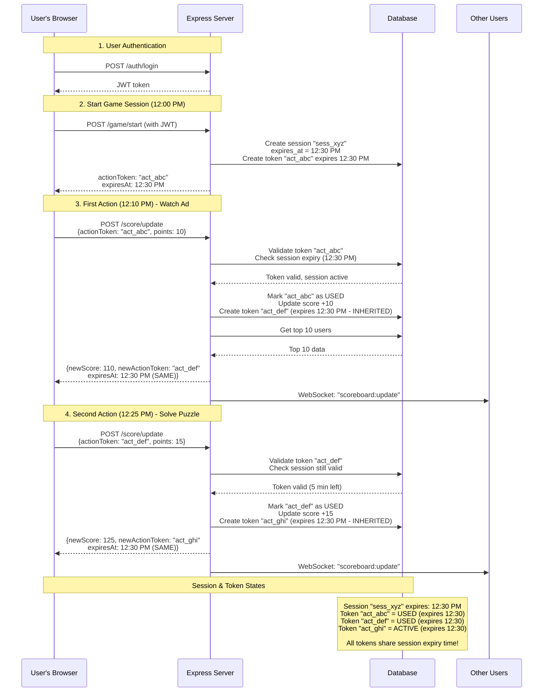

# Real-Time Scoreboard System - Technical Specification

## Table of Contents

1. [System Overview](#system-overview)
2. [Action Token System](#action-token-system)
3. [Technical Requirements](#technical-requirements)
4. [API Specifications](#api-specifications)
5. [WebSocket Events](#websocket-events)
6. [Security Design](#security-design)
7. [Database Schema](#database-schema)
8. [Implementation Phases](#implementation-phases)
9. [Error Handling](#error-handling)
10. [Performance Considerations](#performance-considerations)
11. [Future Improvements](#future-improvements)

---

## System Overview

### Purpose

Build a real-time scoreboard system that displays the top 10 users' scores with live updates. The system must prevent unauthorized score manipulation while providing instant feedback to all connected clients.

### Key Features

- **Real-time Updates**: Live scoreboard updates using WebSocket connections
- **Secure Score Updates**: Action token system to prevent malicious score manipulation
- **Top 10 Leaderboard**: Displays only the top 10 users sorted by score (descending)
- **Action Validation**: Server-side verification ensures users can't cheat
- **Broadcast Mechanism**: All connected clients receive updates instantly

### Technology Stack

- **Backend**: Node.js with Express.js
- **WebSocket**: Socket.IO for real-time bidirectional communication
- **Database**: SQLite (or PostgreSQL/MySQL for production)
- **Authentication**: JWT (JSON Web Tokens)
- **Language**: TypeScript

---

## Action Token System

### The Problem We're Solving

**Without security**, a malicious user could:

- Use tools like Postman to call the API directly: `updateScore(userId: 123, points: 999)`
- Write a script to spam score updates
- Manipulate their score without actually playing the game

---

### The Solution: Action Tokens (Like Amusement Park Wristbands)

Think of action tokens like **amusement park wristbands with ride stamps**:

1. **You enter the park** -> Get a wristband that's valid until park closing (30-minute game session)
2. **Ride a roller coaster** -> Staff stamps your wristband, tears off the stamp, gives you a NEW stamp
3. **Each stamp is single-use** -> Once torn off, can't be reused
4. **All stamps expire at same time** -> When park closes (session ends), all stamps become invalid
5. **Can't fake stamps** -> Park staff validates stamps before each ride

**Key Difference:**

- Individual stamps are one-time-use (prevents reuse)
- But all stamps expire at the same session end time (no mid-game timeouts)

### Why This Prevents Cheating

**Can't call API directly from console**

- Every request needs a valid action token

**Can't fake action completions**

- Server validates token with each request

**Can't spam unlimited score updates**

- Rate limiting on score update endpoint

**Can't steal someone else's token**

- Token is linked to specific user ID
- Server verifies token ownership

### Simple Example

```
LEGITIMATE USER:
12:00 PM - Click "Start Game" -> Session expires at 12:30 PM
           Get token "act_abc123" (expires 12:30 PM)

12:10 PM - Watch 30-sec ad -> Send {token: "act_abc123", points: 10}
           -> Server validates -> Score +10
           -> Token "act_abc123" is discarded
           -> Server returns NEW token "act_def456" (SAME expiry: 12:30 PM)

12:15 PM - Solve puzzle -> Send {token: "act_def456", points: 15}
           -> Server validates -> Score +15
           -> Token "act_def456" is discarded
           -> Server returns NEW token "act_ghi789" (SAME expiry: 12:30 PM)

12:29 PM - Complete level -> Token "act_ghi789" still valid (1 min left)
           -> Works fine!

12:31 PM - Try another action -> Session expired
           -> Server: "Session expired, please start new game"

MALICIOUS USER ATTEMPTS:
1. Try to call API without token
   -> Server: "No action token provided"

2. Try to use fake token "act_hacker123"
   -> Server: "Invalid token"

3. Try to reuse old token "act_abc123" (already used)
   -> Server: "Token has been used, use latest token"

4. Try to use token after session expired (12:31 PM)
   -> Server: "Session expired, please restart game"

5. Try to send unrealistic points
   -> Server: "Invalid points value"

6. Try to spam 100 requests per second
   -> Server: "Rate limit exceeded"
```

---

## Technical Requirements

### Functional Requirements

**1. User Authentication**

- Users must log in to get a JWT token
- JWT token required for all API requests (except top 10 scoreboard) and WebSocket connections

**2. Action Token System (Game Session Tokens)**

- Server generates action token when user starts a game session
- Each token:
  - Has a random, unpredictable ID (e.g., `act_a1b2c3d4e5f6`)
  - Is discarded after use
  - Is linked to a specific user

**3. Score Updates**

- Every action completion includes the action token
- Server validates token with each score update request
- Server verifies action type and points are valid
- Token validation happens server-side
- Score updates are atomic (all-or-nothing)

**4. Real-time Leaderboard**

- Display top 10 users sorted by score (highest first)
- Auto-refresh when anyone's score changes
- All connected users see updates simultaneously

**5. WebSocket Connection**

- Persistent connection between client and server
- Automatic reconnection if connection drops
- JWT authentication required to connect

### Non-Functional Requirements

**1. Performance**

- Support 1000+ simultaneous WebSocket connections
- Scoreboard updates in < 100ms
- Database queries optimized with indexes

**2. Security**

- No way to manipulate scores without valid action tokens
- Rate limiting prevents spam
- Input validation on all endpoints
- SQL injection protection

**3. Scalability**

- Can add more servers with Redis adapter
- Database connection pooling for efficiency

**4. Reliability**

- Graceful error handling
- Database transactions for score updates
- Automatic cleanup of expired tokens

---

## API Specifications

### Base URL

```
http://localhost:3000/api
```

### Authentication Header (Required for all endpoints)

```
Authorization: Bearer <jwt_token>
```

---

### Endpoint 1: User Login

**Purpose:** Get JWT token to authenticate

**Request:**

```
POST /auth/login

Body:
{
  "username": "john_doe",
  "password": "SecurePass123"
}
```

**Response:**

```json
{
  "data": {
    "token": "eyJhbGciOiJIUzI1NiIsInR5cCI6IkpXVCJ9...",
    "user": {
      "id": 25,
      "username": "john_doe",
      "score": 100
    }
  },
  "message": "Login successful",
  "statusCode": 200,
  "metadata": {}
}
```

---

### Endpoint 2: Start Game Session (Get Action Token)

**Purpose:** Get an action token when starting to play

**Request:**

```
POST /game/start

Headers:
Authorization: Bearer <jwt_token>
```

**Response:**

```json
{
  "data": {
    "actionToken": "act_a1b2c3d4e5f6g7h8i9j0",
    "expiresAt": "2024-01-05T11:05:00.000Z",
    "sessionDuration": 1800
  },
  "message": "Game session started",
  "statusCode": 200,
  "metadata": {}
}
```

**Notes:**

- Creates a new game session valid for 30 minutes (1800 seconds)
- All tokens generated during this session will expire at the same time
- User should store this token and include it in all action requests
- One user can only have one active session at a time
- Session expiry is shared across all tokens in the session

---

### Endpoint 3: Update Score (Complete Action)

**Purpose:** Update score when user completes an action

**Request:**

```
POST /score/update

Headers:
Authorization: Bearer <jwt_token>

Body:
{
  "actionToken": "act_a1b2c3d4e5f6g7h8i9j0",
  "actionType": "watch_ad",
  "points": 10
}
```

**Success Response:**

```json
{
  "data": {
    "newScore": 110,
    "pointsEarned": 10,
    "rank": 15,
    "newActionToken": "act_k9l8m7n6o5p4q3r2s1t0",
    "expiresAt": "2024-01-05T11:05:00.000Z"
  },
  "message": "Score updated successfully",
  "statusCode": 200,
  "metadata": {}
}
```

**Important Notes:**

- The old action token is now **discarded** and cannot be reused
- A **new action token** is generated and returned in the response
- Client must use the new token for the next action
- The new token **inherits the session expiry time** (NOT a new 30 minutes)
- All tokens in the same session expire at the original session end time
- Example: If session ends at 12:30 PM, all tokens expire at 12:30 PM regardless of when they were created

**Error Responses:**

Invalid Token:

```json
{
  "data": null,
  "message": "Invalid or expired action token",
  "statusCode": 401,
  "metadata": {
    "errorCode": "INVALID_TOKEN"
  }
}
```

Invalid Action Type:

```json
{
  "data": null,
  "message": "Invalid action type",
  "statusCode": 400,
  "metadata": {
    "errorCode": "INVALID_ACTION"
  }
}
```

**Valid Action Types:**

- `watch_ad` - 10 points
- `solve_puzzle` - 15 points
- `complete_level` - 20 points
- `daily_bonus` - 5 points

**Rate Limit:** Maximum 10 score updates per minute per user

---

### Endpoint 4: End Game Session

**Purpose:** Invalidate action token when user stops playing

**Request:**

```
POST /game/end

Headers:
Authorization: Bearer <jwt_token>
```

**Response:**

```json
{
  "data": {
    "finalScore": 150,
    "actionsCompleted": 8,
    "sessionDuration": 420
  },
  "message": "Game session ended",
  "statusCode": 200,
  "metadata": {}
}
```

---

### Endpoint 5: Get Top 10 Scoreboard

**Purpose:** Retrieve current leaderboard

**Request:**

```
GET /scoreboard/top10
```

**Response:**

```json
{
  "data": [
    {
      "rank": 1,
      "userId": 42,
      "username": "player_one",
      "score": 5420
    },
    {
      "rank": 2,
      "userId": 17,
      "username": "pro_gamer",
      "score": 4890
    }
  ],
  "message": "Scoreboard retrieved successfully",
  "statusCode": 200,
  "metadata": {
    "total": 10
  }
}
```

---

### Endpoint 6: Get User's Score and Rank

**Purpose:** Check specific user's position

**Request:**

```
GET /scoreboard/user/:userId
```

**Response:**

```json
{
  "data": {
    "userId": 25,
    "username": "john_doe",
    "score": 110,
    "rank": 15
  },
  "message": "User score retrieved successfully",
  "statusCode": 200,
  "metadata": {}
}
```

---

## Complete User Flow (Sequence Diagram)



---

## WebSocket Events

### Connection Flow

**Client Connects:**

```javascript
// Client side
const socket = io("http://localhost:3000", {
  auth: {
    token: "Bearer <jwt_token>",
  },
});
```

**Server Confirms:**

```json
Event: "connect_success"
Data: {
  "message": "Connected successfully",
  "userId": 25,
  "username": "john_doe"
}
```

**Connection Failed:**

```json
Event: "connect_error"
Data: {
  "message": "Authentication failed",
  "code": "INVALID_TOKEN"
}
```

---

### Real-time Updates

**Scoreboard Update (Broadcast to All)**

```json
Event: "scoreboard:update"
Data: {
  "top10": [
    {
      "rank": 1,
      "userId": 42,
      "username": "player_one",
      "score": 5420
    }
  ],
  "timestamp": "2024-01-05T10:35:05.000Z"
}
```

**Personal Score Update (Sent to Specific User)**

```json
Event: "score:personal"
Data: {
  "userId": 25,
  "score": 110,
  "rank": 15,
  "pointsEarned": 10,
  "previousRank": 16
}
```

---

## Security Design

### 1. JWT Authentication

**What it does:**

- Proves user identity
- Required for all API calls and WebSocket connections
- Contains user information (id, username)
- Expires after 24 hours

**How it works:**

1. User logs in with username/password
2. Server generates JWT token
3. Client includes token in all requests
4. Server verifies token before processing

---

### 2. Action Token System (Session-Based One-Time-Use)

**Purpose:** Ensure only legitimate game actions can update scores

**Design:**

```
Session Format: sess_<20_random_characters>
Token Format: act_<20_random_characters>
Example Session: sess_x1y2z3a4b5c6d7e8f9g0
Example Token: act_a1b2c3d4e5f6g7h8i9j0

Token Properties:
- Unique ID (randomly generated)
- Session ID (links all tokens in same game session)
- User ID (who owns this token)
- Created At (when token was issued)
- Expires At (inherited from session - all tokens expire together)
- Is Active (boolean: false after first use)
```

**Session & Token Lifecycle:**

```
1. Start Game -> Session created, expires_at = now + 30 minutes
2. First Token Created -> token.expires_at = session.expires_at
3. Token Used -> is_active = false (cannot be reused)
4. New Token Generated -> token.expires_at = session.expires_at (SAME TIME)
5. Repeat steps 3-4...
6. Session Expires -> All tokens in session become invalid
```

**Key Example:**

```
12:00 PM: Start game -> Session expires at 12:30 PM
12:00 PM: Token A created -> expires at 12:30 PM
12:10 PM: Token A used -> Token B created -> expires at 12:30 PM (inherited)
12:25 PM: Token B used -> Token C created -> expires at 12:30 PM (inherited)
12:30 PM: Session ends -> All tokens (A, B, C) expire
```

**Validation Rules:**

1. Token must exist in database
2. Token must not be expired (check session expiry time)
3. Token must be active (is_active = true, not used yet)
4. Token must belong to requesting user
5. Session must still be valid
6. Action type must be valid
7. Points must match action type
8. All checks must pass before updating score

**Why Session-Based One-Time-Use?**

- **Prevents replay attacks**: Old tokens can't be reused (one-time-use)
- **Better UX**: No mid-game timeouts due to individual token expiry
- **Limits damage**: Stolen token only works once
- **Session control**: Natural 30-minute game boundary
- **Auditable**: Clear chain of token usage with session tracking
- **Forces fresh validation**: Each action gets fresh server check

---

### 3. Rate Limiting

**Prevents spam and abuse:**

- Start Game: 5 requests per hour per user
- Update Score: 10 requests per minute per user
- Login: 3 attempts per minute per user

---

### 4. Input Validation

**Score Update Validation:**

- Action token: Must match format `act_[a-zA-Z0-9]{20}`
- Action type: Must be in allowed list
- Points: Must match action type points value
- Request rate: Max 10 per minute

**Example Validation:**

```
If action = "watch_ad", points MUST be 10
If action = "solve_puzzle", points MUST be 15
If points don't match -> Reject request
```

---

## Database Schema

### Users Table

```sql
CREATE TABLE users (
  id INTEGER PRIMARY KEY AUTOINCREMENT,
  username VARCHAR(50) UNIQUE NOT NULL,
  email VARCHAR(100) UNIQUE NOT NULL,
  password_hash TEXT NOT NULL,
  score INTEGER DEFAULT 0,
  created_at DATETIME DEFAULT CURRENT_TIMESTAMP,
  updated_at DATETIME DEFAULT CURRENT_TIMESTAMP
);

-- Indexes for fast queries
CREATE INDEX idx_users_score ON users(score DESC);
CREATE INDEX idx_users_username ON users(username);
```

### Game Sessions Table

```sql
CREATE TABLE game_sessions (
  id INTEGER PRIMARY KEY AUTOINCREMENT,
  session_id VARCHAR(50) UNIQUE NOT NULL,
  user_id INTEGER NOT NULL,
  is_active BOOLEAN DEFAULT 1,
  created_at DATETIME DEFAULT CURRENT_TIMESTAMP,
  expires_at DATETIME NOT NULL,
  ended_at DATETIME,
  actions_count INTEGER DEFAULT 0,
  FOREIGN KEY (user_id) REFERENCES users(id)
);

-- Indexes for fast lookups
CREATE INDEX idx_sessions_session_id ON game_sessions(session_id);
CREATE INDEX idx_sessions_user_id ON game_sessions(user_id);
CREATE INDEX idx_sessions_expires_at ON game_sessions(expires_at);
CREATE INDEX idx_sessions_is_active ON game_sessions(is_active, user_id);
```

### Action Tokens Table (One-Time-Use Tokens)

```sql
CREATE TABLE action_tokens (
  id INTEGER PRIMARY KEY AUTOINCREMENT,
  action_token_hash VARCHAR(50) UNIQUE NOT NULL,
  session_id VARCHAR(50) NOT NULL,
  user_id INTEGER NOT NULL,
  is_active BOOLEAN DEFAULT 1,
  created_at DATETIME DEFAULT CURRENT_TIMESTAMP,
  expires_at DATETIME NOT NULL,
  used_at DATETIME,
  FOREIGN KEY (user_id) REFERENCES users(id),
  FOREIGN KEY (session_id) REFERENCES game_sessions(session_id)
);

-- Indexes for fast lookups
CREATE INDEX idx_tokens_token ON action_tokens(action_token_hash);
CREATE INDEX idx_tokens_session_id ON action_tokens(session_id);
CREATE INDEX idx_tokens_user_id ON action_tokens(user_id);
CREATE INDEX idx_tokens_is_active ON action_tokens(is_active);
```

### Score History Table (Optional - for auditing)

```sql
CREATE TABLE score_history (
  id INTEGER PRIMARY KEY AUTOINCREMENT,
  user_id INTEGER NOT NULL,
  action_type VARCHAR(50) NOT NULL,
  points_earned INTEGER NOT NULL,
  action_token_hash VARCHAR(50) NOT NULL,
  score_before INTEGER NOT NULL,
  score_after INTEGER NOT NULL,
  created_at DATETIME DEFAULT CURRENT_TIMESTAMP,
  FOREIGN KEY (user_id) REFERENCES users(id)
);

-- Index for querying user history
CREATE INDEX idx_score_history_user_id ON score_history(user_id);
CREATE INDEX idx_score_history_created_at ON score_history(created_at DESC);
```

---

## Implementation Phases

### Phase 1: Foundation

**Goal:** Set up basic infrastructure

**Tasks:**

1. Initialize TypeScript project
2. Install dependencies (Express, Socket.IO, SQLite, JWT, etc.)
3. Create database schema
4. Set up environment variables
5. Build user authentication (register, login)
6. Create JWT middleware

**Deliverables:**

- Users can register and login
- JWT tokens are generated
- Database is set up

---

### Phase 2: Action Token System

**Goal:** Implement game tokens

**Tasks:**

1. Create "start game" endpoint (generates action token)
2. Create "end game" endpoint (invalidates token)
3. Implement token validation middleware
4. Add rate limiting
5. Build token cleanup job (delete expired tokens)

**Deliverables:**

- Users can start game
- Action tokens are generated and validated

---

### Phase 3: Score Update Logic

**Goal:** Implement secure score updates

**Tasks:**

1. Create score update endpoint
2. Implement action type validation
3. Add points verification
4. Ensure atomic updates with transactions
5. Add score history tracking

**Deliverables:**

- Scores update correctly with valid tokens
- Invalid requests are rejected
- All updates are logged

---

### Phase 4: WebSocket Integration

**Goal:** Enable real-time communication

**Tasks:**

1. Set up Socket.IO server
2. Implement WebSocket authentication
3. Create connection handlers
4. Build broadcast mechanism for scoreboard updates
5. Test with multiple clients

**Deliverables:**

- Clients can connect via WebSocket
- Server broadcasts score updates
- All clients see changes in real-time

---

### Phase 5: Testing & Polish

**Goal:** Ensure system is production-ready

**Tasks:**

1. Write unit tests for all endpoints
2. Perform load testing (1000 concurrent connections)
3. Test cheating scenarios
4. Fix bugs and edge cases
5. Add comprehensive error handling

**Deliverables:**

- System handles 1000+ connections
- Cheating attempts are blocked
- All edge cases covered

---

## Error Handling

### Standard Error Response Format

```json
{
  "data": null,
  "message": "Descriptive error message",
  "statusCode": 400,
  "metadata": {
    "errorCode": "ERROR_CODE_HERE",
    "timestamp": "2024-01-05T10:35:00.000Z"
  }
}
```

### Error Codes Reference

- **`INVALID_TOKEN`** (401)

  - Description: JWT or action token is invalid
  - User Action: Login again or start new game

- **`TOKEN_EXPIRED`** (401)

  - Description: Action token has expired
  - User Action: Start new game

- **`TOKEN_NOT_FOUND`** (404)

  - Description: No active game token
  - User Action: Start a game first

- **`INVALID_ACTION`** (400)

  - Description: Action type not recognized
  - User Action: Use valid action type

- **`TOKEN_ALREADY_USED`** (409)

  - Description: token exists but is_active is false
  - User action: use latest token returned by server

- **`INVALID_POINTS`** (400)

  - Description: Points don't match action
  - User Action: Check action type

- **`RATE_LIMIT_EXCEEDED`** (429)

  - Description: Too many requests
  - User Action: Slow down

- **`UNAUTHORIZED`** (401)

  - Description: No authentication provided
  - User Action: Login required

- **`USER_NOT_FOUND`** (404)

  - Description: User doesn't exist
  - User Action: Register or check username

- **`INTERNAL_ERROR`** (500)
  - Description: Server error
  - User Action: Try again later

---

## Future Improvements

### Analytics Dashboard

**Track metrics:**

- Most active users
- Average actions per session
- Peak usage times
- Score distribution graphs
- Cheat detection alerts

---

### User Features

**Achievements:**

- Badges for milestones
- User profiles showing history
- Daily/weekly challenges

**More Action Types:**

- Different difficulty levels
- Combo bonuses
- Time-limited events

---

## Conclusion

This specification provides a complete design for a secure, real-time scoreboard system.

---

**Document Version:** 1.0
**Last Updated:** January 14 2026
**Prepared for:** Backend Engineering Team
